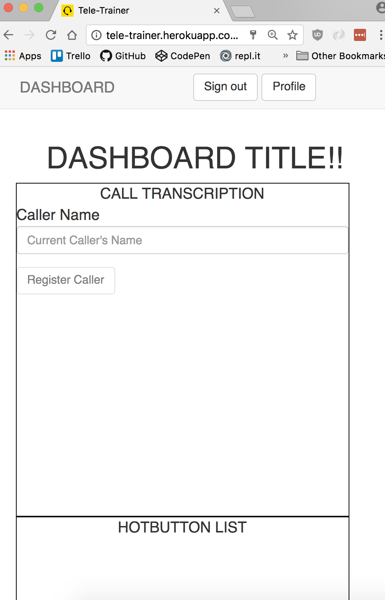
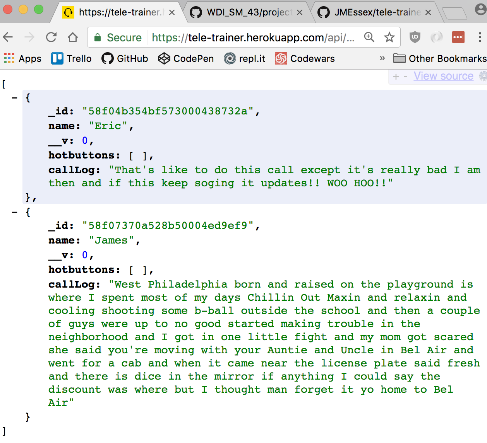
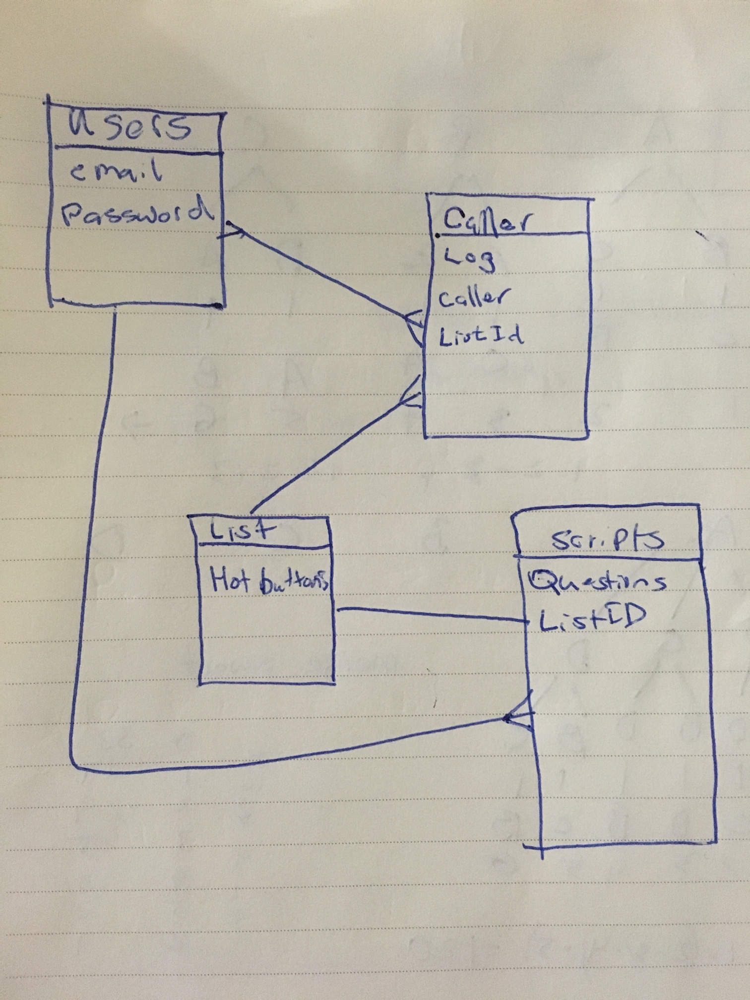

# Project #4: Tele-Trainer

## Description

Tele-Trainer is an app for training telemarketers. Based on the habit formation forumlas, this simple to use application would allow the trainee to focus their time more efficently on one specific task to build the desired "Gun" responces to prospects conversations.  We are talking about prospects "HOT BUTTONS".

## Completed MVP as of Code Freeze (4/13 11pm)

## Technologies

* **Mongoose**
* **Express**
* **Angular 1.X**
* **Node.js**
* **Socket.io**
* **JWTS**
* **OAuth**
* **Google Voice API**

## General Approach
I decided to develop this application as a back-end API with a seperate front-end interface.  Also I wanted to incorporate JSON Web Tokens As my authorization method.  I started by completing the back-end api first, followed by the users token intigration and lastly the front end.

## Installation
1. Clone or download this repository to your machine.
2. Confirm you have `Node.js` installed by running `node -v` (I have `v7.7.1`).

> If you aren't getting a version number, head over to https://nodejs.org/en/download/ and download it.

3. `cd` into the root of your local copy of the app and run `npm install`.
4. Start the database server with `mongod`.
5. In a new terminal tab (staying in the root), seed the database with `node back-end/config/seeds`
6. Start the server with `nodemon` or `node server.js`.
7. Navigate to `localhost:3000`, and you're good to go!

## Unsolved Problems
Currently I was not able to get the Chrome Webkit to fully be intigrated into my app.  This is one of the larger stretch goals and could make or brake the effectiveness of the app.

## [Trello](https://trello.com/b/NPEKZgut/tele-trainer)
um... just click the link above, nothing down here to see.

## ERD

## Wireframe

