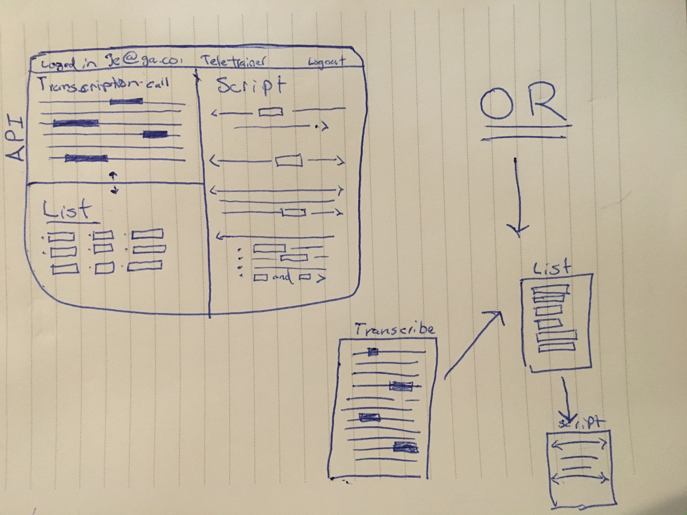

# Project #4: Tele-Trainer

## Description

Tele-Trainer is an app for training telemarketers. Based on the habit formation forumlas, this simple to use application would allow the trainee to focus their time more efficently on one specific task to build the desired "Gun" responces to prospects conversations.  We are talking about prospects "HOT BUTTONS".

## Technologies

* **Mongoose**
* **Express**
* **Angular 1.X**
* **Node.js**
* **Socket.io**
* **JWTS**
* **OAuth**
* **Google Voice API**

## [Trello](https://trello.com/b/NPEKZgut/tele-trainer)
um... just click the link above, nothing down here to see.

## ERD

## Wireframe
